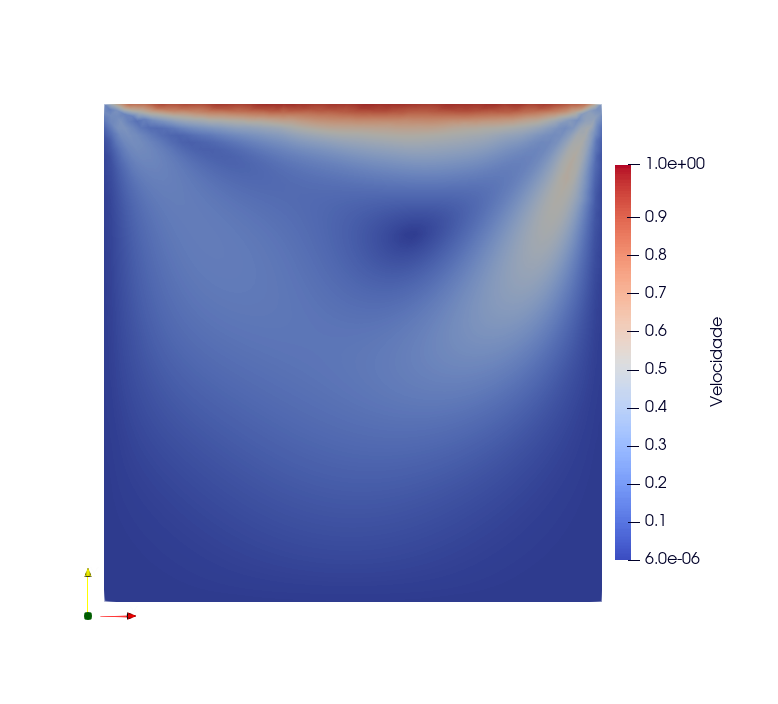
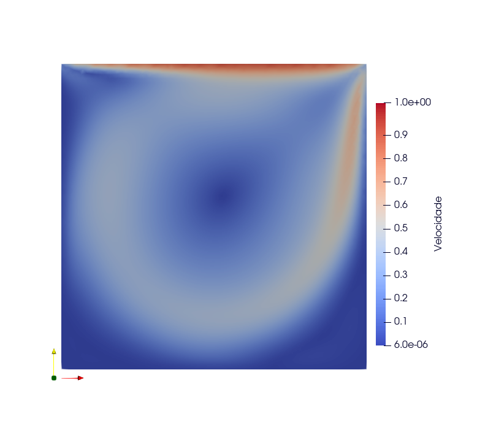
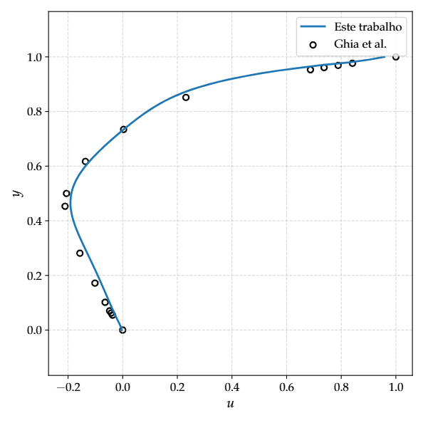
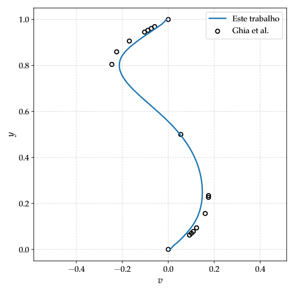

# TCC – UFJF (Undergraduate Thesis)

**Student:** Ricardo Ervilha Silva  
**Advisor:** Prof. Dr. José Jerônimo Camata  

Repository of the Undergraduate Thesis (2025.3) developed at the **Federal University of Juiz de Fora (UFJF)** for the **Computer Science** course.

---

## 🎯 Objective

This project presents the development of a numerical solver, named **$R_e$ FUM2D**, based on the **Finite Volume Method (FVM)**. The solver is designed to read and simulate **unstructured meshes** in `.msh` format generated by **Gmsh (ASCII version 2)**.

The numerical formulation and solution of the resulting linear systems rely on the **Eigen** library for **C++ linear algebra**, which provides efficient and robust tools for matrix and vector operations required by the finite volume discretization.

The numerical results are exported in the **VTK** format, enabling post-processing and visualization of flow fields—such as velocity and pressure—using **ParaView**.

---

## 📁 Directory Structure

## 📁
├── app/ # main.cpp and YAML configuration files\
├── build/ # CMake and Make generated files\
├── docs/ # documentation files\
├── include/ # header files\
├── inputs/ # .msh mesh files\
├── outputs/ # .vtk result files\
├── src/ # source code implementations


---

## ⚙️ How to Use

### Prerequisites

- G++ ≥ 17  
- CMake ≥ 3.10  
- [Gmsh](https://gmsh.info/)  
- [ParaView](https://www.paraview.org/)

### Compilation and Execution

```bash
# From the project root
mkdir build
cd build
cmake ..
make

# After compilation
./TCC.exe ./yaml_file.YAML
```

## 📝 YAML Input File

The simulation setup is defined through a YAML configuration file with the following structure:

```yaml
problem:
  name: Lid-Driven Cavity Flow
  nu: 1e-2
  rho: 1.0
  reynolds: 100
  boundaries:
    u:
      - { type: DIRICHLET, region: TOP, value: one }
      - { type: DIRICHLET, region: BOTTOM, value: zero }
      - { type: DIRICHLET, region: LEFT, value: zero }
      - { type: DIRICHLET, region: RIGHT, value: zero }

    v:
      - { type: DIRICHLET, region: TOP, value: zero }
      - { type: DIRICHLET, region: BOTTOM, value: zero }
      - { type: DIRICHLET, region: LEFT, value: zero }
      - { type: DIRICHLET, region: RIGHT, value: zero }

    p:
      - { type: NEUMANN, region: TOP, value: zero }
      - { type: NEUMANN, region: BOTTOM, value: zero }
      - { type: NEUMANN, region: LEFT, value: zero }
      - { type: NEUMANN, region: RIGHT, value: zero }

mshfile: ../inputs/lid_driven_cavity_flow_8656.msh

simple:
  momentum:
    lambda_uv: 0.6
    non_corrections: 6
    iterations_bicgstab: 200
    tolerance_bicgstab: 1e-6

  pressure_correction:
    lambda_p: 0.3
    iterations_bicgstab: 100
    tolerance_bicgstab: 1e-4
  
  utol: 1e-8
  vtol: 1e-8
  ptol: 1e-8

save_iterations: yes
exportfolder: "../outputs/"
```

## Configuration Details

* name: Used to label output files along with the Reynolds number.

* rho and nu: Fluid density and kinematic viscosity.

* boundaries: Boundary conditions for velocity components (u, v) and pressure (p).

* Boundary regions must match those defined in the Gmsh file.

* Supported types: "DIRICHLET" prescribed value and "NEUMANN" prescribed gradient.

* Boundary values are defined in Orchestrator.h, where user-defined C++ functions can be referenced from the YAML file.

* SIMPLE parameters include under-relaxation factors, linear solver tolerances, and iteration limits.

* Global tolerances (utol, vtol, ptol) control the convergence criteria.

* If save_iterations is enabled, the solver stores error histories, allowing convergence analysis via maximum norm plots.

## 🧪 Lid-Driven Cavity Flow

This section demonstrates the solver’s capability to handle Reynolds numbers $R_e = 100$ (left) and $R_e = 1000$ (right) using an unstructured mesh composed of 8,656 control volumes.

<div style="display: flex; gap: 10px;">   </div>

Also, The numerical results are compared with the classical benchmark by Ghia et al. for $R_e = 100$.

* Left: Horizontal velocity profile

* Right: Vertical velocity profile

<div style="display: flex; gap: 10px;">   </div>

## Keywords

``Computational Fluid Dynamics``, ``Finite Volume Method``, ``Unstructured Meshes``, ``Numerical Methods``, ``Navier–Stokes Equations``.

## Reference

**Guennebaud, G.; Jacob, B.; et al.** *Eigen v3*. A C++ template library for linear algebra. Available at: https://eigen.tuxfamily.org. Accessed in January 2026.

If you are interested in this work, please consider reading:

SILVA, R. E., $R_e$ FUM2D: Uma ferramenta de volumes finitos para a simulação das equações de Navier–Stokes em C++. Trabalho de Conclusão de Curso em Ciência da Computação — Universidade Federal de Juiz de Fora, Juiz de Fora, 2026. Orientador: José Jerônimo Camata.
